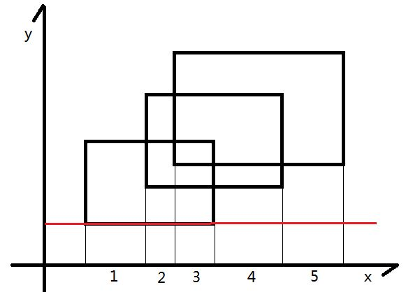
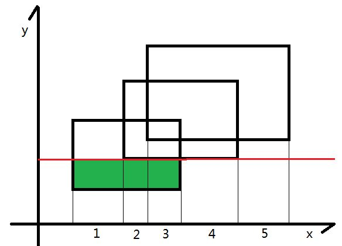
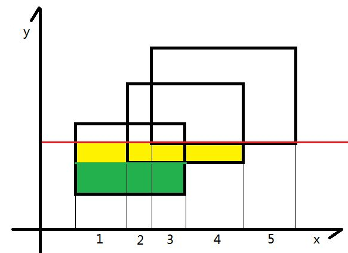
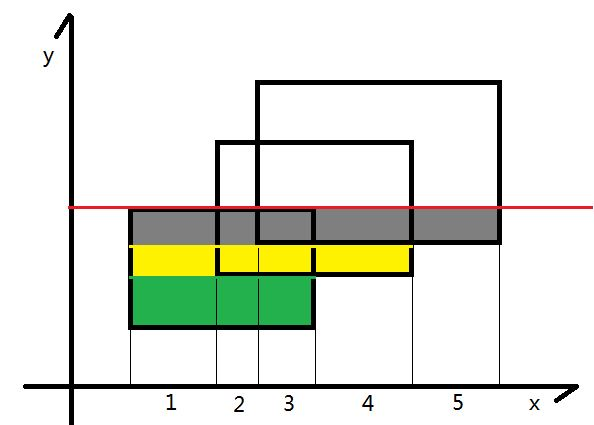
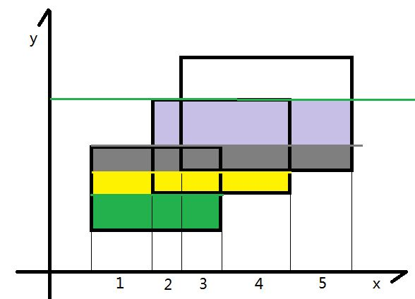
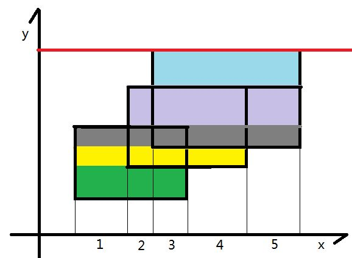

扫描线入门题

借用一下某位大佬的图







先离散化横坐标
每个矩形分成上下两条线，下入上出
用$$sz$$数组记录当前区间被覆盖宽度
具体细节看代码
<!--more-->

```c++
#include<cstdio>
#include<cstring>
#include<algorithm>
using namespace std;
const int N=205;
struct node{double l,r,h;int val;}t[N<<2];
int num[N<<4],ql,qr;
double sz[N<<4],w[N<<4];
inline int read()
{
    register int x=0,t=1;
    register char ch=getchar();
    while (ch!='-'&&(ch<'0'||ch>'9')) ch=getchar();
    if (ch=='-') t=-1,ch=getchar();
    while (ch>='0'&&ch<='9') x=x*10+ch-48,ch=getchar();
    return x*t;
}
bool cmp(node a,node b){return a.h<b.h;};
void calc(int o,int l,int r)
{
    if (num[o])	//full
        sz[o]=w[r+1]-w[l];
    else    //not
        sz[o]=sz[o<<1]+sz[o<<1|1];
}
void modify(int o,int l,int r,int x)
{
    if (ql<=l&&r<=qr)
    {
        num[o]+=x;
        calc(o,l,r);
        return;
    }
    int mid=(l+r)>>1;
    if (ql<=mid) modify(o<<1,l,mid,x);
    if (qr>mid) modify(o<<1|1,mid+1,r,x);
    calc(o,l,r);
}
int main()
{
    int Case=0,n;
    while (n=read())
    {
        double ans=0;
        int cnt=0;
        memset(num,0,sizeof(num));
        memset(sz,0,sizeof(sz));
        for(int i=1;i<=n;i++)
        {
            double x1,y1,x2,y2;
            scanf("%lf%lf%lf%lf",&x1,&y1,&x2,&y2);
            w[i]=x1,w[i+n]=x2;
            t[++cnt]=(node){x1,x2,y1,1};
            t[++cnt]=(node){x1,x2,y2,-1};
        }
        n<<=1;
        sort(w+1,w+n+1);
        int idx=unique(w+1,w+n+1)-w-1;
        sort(t+1,t+cnt+1,cmp);
        for(int i=1;i<n;i++)
        {
            ql=lower_bound(w+1,w+idx+1,t[i].l)-w;
            qr=lower_bound(w+1,w+idx+1,t[i].r)-w-1;
            if (ql<=qr) modify(1,1,idx,t[i].val);
            ans+=sz[1]*(t[i+1].h-t[i].h);
        }
        printf("%.2lf\n",ans);
    }
    return 0;
}
```

