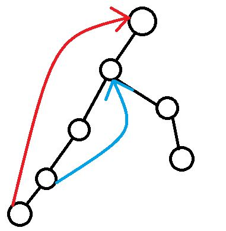

如果问题是在一个区间上的，那就成了一个经典的贪心问题
将所有区间按照右端点升序排序之后，每个未满足的区间尽可能向右染即可

在树上也可以贪心
将所有链按父节点深度降序排序之后，每条未满足的链尽可能往高处染
- 因为是按照父节点深度降序，如下图，在处理红链时不可能出现未处理的蓝链

- 对于每条未满足的链，显然染的越高能覆盖的就越多

<!--more-->
```c++
#include<cstdio>
#include<vector>
#include<cstring>
#include<algorithm>
using namespace std;
const int N=20050,rt=1;
struct edge{int u,v;}t[N];
int n,m,dep[N],fa[N],used[N];
vector<int> e[N];
void dfs(int o)
{
    for(int i=0;i<e[o].size();i++)
    {
        int to=e[o][i];
        if (!dep[to])
        {
            dep[to]=dep[o]+1;
            fa[to]=o;
            dfs(to);
        }
    }
}
bool cmp(edge a,edge b)
{
    if (dep[a.u]==dep[b.u]) return dep[a.v]>dep[b.v];
    return dep[a.u]>dep[b.u];
}
int check(int k)
{
    int x=t[k].v;
    for(;fa[x]!=t[k].u;x=fa[x])
        if (used[x]) return 0;
    if (used[x]) return 0;
    return used[x]=1; 
}
int main()
{
    while (~scanf("%d%d",&n,&m)&&n&&m)
    {
        for(int i=1;i<=n;i++) e[i].clear();
        memset(dep,0,sizeof(dep));
        memset(used,0,sizeof(used));
        memset(fa,0,sizeof(fa));
        for(int i=1;i<n;i++)
        {
            int u,v;
            scanf("%d%d",&u,&v);
            e[u].push_back(v);
            e[v].push_back(u);
        }
        dep[rt]=1,dfs(rt);
        for(int i=n;i<=m;i++)
        {
            int u,v;
            scanf("%d%d",&u,&v);
            if (dep[u]>dep[v]) swap(u,v);
            t[i-n+1].u=u;
            t[i-n+1].v=v;
        }
        sort(t+1,t+m-n+2,cmp);
        int ans=0;
        for(int i=n;i<=m;i++)
            if (check(i-n+1)) ans++;
        printf("%d\n",ans);
    }
    return 0;
}
```

