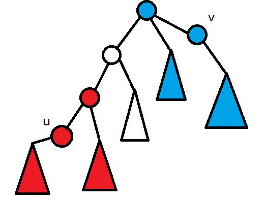

~~三色**~~

首先考虑两种颜色，分别在*u*，*v*
由于路径唯一，两种颜色还是比较好求的
只要取$\left ( u,v \right )$路径中点，将树分为两半即可，每个点分别控制一半
如图


现在有三种颜色，也就是求交集
求交集可以用线段树，先把树转化为*dfs* 序，然后第一次区间加，第二次区间询问

~~不知道为什么写挂了，于是写了个分类讨论~~
记录一个二元组$\left ( opt,x \right )$，$x$为子树根节点，$opt=1$表示可选，*0* 则表示不可选
观察到两棵子树之间只有两种关系，要么不相交，要么一棵树是另一棵树的子树
判断是否相交用$LCA$即可
然后分类讨论，设两棵子树分别以$A$，$B$为根，且$A_{sz}\leq B_{sz}$
- 均可选，若两棵子树不相交则为*0* ，否则为$A_{sz}$
- 均不可选，若两棵子树不相交则为$n-A_{sz}-B_{sz}$，否则为$B_{sz}$
- 一个可选，一个不可选

  设$A_{opt}=1$，$B_{opt}=0$，这里对$sz$没有要求
  - $LCA\left ( A,B \right )=A$，答案为$A_{sz}-B_{sz}$
  - $LCA\left ( A,B \right )=B$，答案为*0* ，但事实上并不会出现这种情况
  - 否则为$A_{sz}$

<!--more-->
```c++
#include<cstdio>
#include<vector>
#include<cstring>
#include<algorithm>
using namespace std;
const int N=1e5+50,rt=1;
struct node{int opt,x;};
int fa[N][25],log[N],sz[N],dep[N],n,m;
vector<int> e[N];
inline int read()
{
    register int x=0,t=1;
    register char ch=getchar();
    while (ch!='-'&&(ch<'0'||ch>'9')) ch=getchar();
    if (ch=='-') t=-1,ch=getchar();
    while (ch>='0'&&ch<='9') x=x*10+ch-48,ch=getchar();
    return x*t;
}
void dfs(int o)
{
    sz[o]=1;
    for(int i=1;i<=log[dep[o]];i++)
        fa[o][i]=fa[fa[o][i-1]][i-1];
    for(int i=0;i<e[o].size();i++)
    {
        int to=e[o][i];
        if (!dep[to])
        {
            dep[to]=dep[o]+1;
            fa[to][0]=o;
            dfs(to);
            sz[o]+=sz[to];
        }
    }
}
int update(int x,int k)
{
    for(int i=0;i<=log[k];i++)
        if ((k>>i)&1) x=fa[x][i];
    return x;
}
int LCA(int u,int v)
{
    if (dep[u]<dep[v]) swap(u,v);
    u=update(u,dep[u]-dep[v]);
    if (u==v) return u;
    for(int i=log[dep[u]];i>=0;i--)
        if (fa[u][i]!=fa[v][i])
            u=fa[u][i],v=fa[v][i];
    return fa[u][0];
}
node find(int u,int v,int pre)
{
    int len=dep[u]+dep[v]-dep[pre]*2;
    if (dep[u]>=dep[v])
        return (node){1,update(u,(len-1)/2)};
    else
        return (node){0,update(v,len/2)};
}
int calc(int x,int u,int v)
{
    node A=find(x,u,LCA(x,u));
    node B=find(x,v,LCA(x,v));
    if (A.opt&&B.opt)
    {
        if (dep[A.x]<dep[B.x]) swap(A,B);
        if (LCA(A.x,B.x)!=B.x) return 0;
        return sz[A.x];
    }
    else if (!A.opt&&!B.opt)
    {
        if (dep[A.x]<dep[B.x]) swap(A,B);
        if (LCA(A.x,B.x)!=B.x)
            return n-sz[A.x]-sz[B.x];
        else
            return n-sz[B.x];
    }
    else
    {
        if (!A.opt) swap(A,B);
        int pre=LCA(A.x,B.x);
        if (pre==A.x) return sz[A.x]-sz[B.x];
        return sz[A.x]; 
    }
}
int main()
{
    int T=read();
    for(int i=1;i<N;i++)
        log[i]=log[i-1]+(1<<log[i-1]==i);
    while (T--)
    {
        n=read();
        for(int i=1;i<=n;i++) e[i].clear();
        memset(dep,0,sizeof(dep));
        memset(fa,0,sizeof(fa));
        for(int i=1;i<n;i++)
        {
            int u=read(),v=read();
            e[u].push_back(v);
            e[v].push_back(u);
        }
        dep[rt]=1,dfs(rt);
        m=read();
        for(int i=1;i<=m;i++)
        {
            int a=read(),b=read(),c=read();
            printf("%d ",calc(a,b,c));
            printf("%d ",calc(b,a,c));
            printf("%d\n",calc(c,a,b));
        }
    }
    return 0;
}
```

