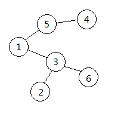

~~这题是一道结论题~~

首先引入$Prufer$序列
**定义**
$Prufer$序列是一种无根树的编码表示，对于一棵$n$个节点带编号的无根树，对应唯一长度为$n-2$的$Prufer$编码。

 **转化过程**
- 树转$Prufer$序列

  每次找到最小的叶子节点并删除，然后在序列中添加其相邻节点的编号，直至剩下两个节点
  如下图
  
  其$Prufer$序列为$3,5,1,3$
  转化过程用优先队列维护可以做到$O\left ( NlogN \right )$

- $Prufer$序列转树

  设点集$V=\left \{x\mid x\notin Prufer \right \}$
  每次取出$Prufer$序列的$front$，将其与$V$中最小元素连边，并删除这两个元素
  若$front$在之后序列中没有出现，则将其加入$V$
  遍历完整个序列后，将$V$中剩下的两个元素连边
  同样可以用优先队列做到$O\left ( NlogN \right )$
  
**性质与结论**  
1. 观察上述过程，不难得出$Prufer$序列与树一一对应
   因此可以快速得出一张$n$个点的完全图有$n^{n-2}$棵生成树，即$$Cayley$$公式 
   
2. 另外，不难发现$Prufer$序列中$x$的出现次数等于$d_{x}-1$，其中$d_{x}$为$x$的度数
   因此当$n$个点的度数分别为$d_{1},d_{2}\dots d_{n}$时，共有$\frac{\left(n-2\right)!}{\prod \left ( d_{i}-1 \right )!}$种生成树
   
3. 更一般的，当其中$x$个点度数已知，$y$个点度数未知时
   记
   $$
   sum=\sum_{i=1}^{x}\left ( d_{i} -1\right )
   $$
   首先考虑$x$个已知节点的方案
   不难得出
   $$
   C_{n-2}^{sum}*\frac{sum!}{\prod_{i=1}^{x}\left ( d_{i}-1 \right )!}
   $$
   然后是$y​$个未知节点
   考虑到每个未填位置均有$y$种可能，共有$$y^{n-2-sum}$$种方案
   根据乘法原理，总方案数为
   $$
   C_{n-2}^{sum}*\frac{sum!}{\prod_{i=1}^{x}\left ( d_{i}-1 \right )!}*y^{n-2-sum}
   $$
   
   
代码就不放了