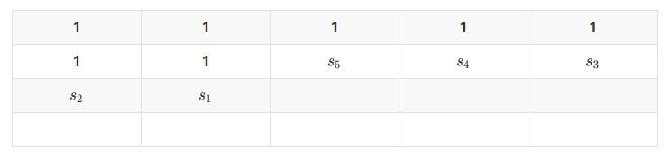

用一下上次的配图


不为草地直接转移
若要种草则需要$$s_{5},s_{1}$$不为草地，且当前位置适合种草
需要注意的是，若当前位置为行首则不需要考虑$$s_{1}$$
<!--more-->
```c++
#include<cstdio>
const int N=15,mod=1e8;
int n,m,w[N][N],dp[2][1<<N],ans=0;
inline int read()
{
    register int x=0,t=1;
    register char ch=getchar();
    while ((ch<'0'||ch>'9')&&ch!='-') ch=getchar();
    if (ch=='-') {t=-1;ch=getchar();}
    while (ch>='0'&&ch<='9') {x=x*10+ch-48;ch=getchar();}
    return x*t;
}
int main()
{
    n=read(),m=read();
    for(int i=1;i<=n;i++)
        for(int j=1;j<=m;j++) w[i][j]=read();
    dp[0][0]=1;
    for(int i=1,now=1;i<=n;i++)
        for(int j=1;j<=m;j++,now^=1)
        {
            int r=(1<<m)-1;
            for(int s=0;s<(1<<m);s++) dp[now][s]=0;
            for(int s=0;s<(1<<m);s++)
            {
                dp[now][(s<<1)&r]=(dp[now][(s<<1)&r]+dp[now^1][s])%mod;
                if (w[i][j]&&(s>>(m-1))&1^1)
                    if (s&1^1||j==1)
                        dp[now][(s<<1)|1&r]=(dp[now][(s<<1)|1&r]+dp[now^1][s])%mod;
            }
        }
    for(int s=0;s<(1<<m);s++)
        ans=(ans+dp[(n*m)&1][s])%mod;
    printf("%d\n",ans);
    return 0;
}
```

