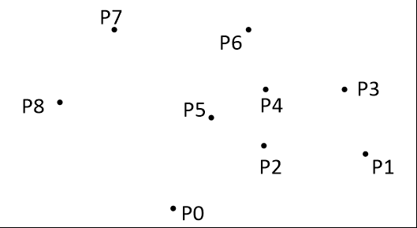

先上图

传统的*Graham* 扫描法
先排序，从左到右，从下到上
做两边，分别做上半部分和下半部分
用栈维护点，发现是凹的就退栈，但起点不能弹掉~~（WA了好久）~~
三点方向可用叉积判断
每一遍做完后栈中剩下的元素就是凸包的顶点
<!--more-->
```c++
#include<cstdio>
#include<cmath>
#include<vector>
#include<algorithm>
using namespace std;
const int N=10050;
const double eps=1e-8;
struct dot{double x,y;};
dot w[N];
int n;
double ans=0;
vector<dot> S;
bool cmp(dot a,dot b) {return fabs(a.x-b.x)<eps?a.y<a.y:a.x<b.x;}
double sqr(double x){return x*x;}
double dist(dot a,dot b) {return sqrt(sqr(a.x-b.x)+sqr(a.y-b.y));}
double cross(dot a,dot b,dot c) {return (b.x-a.x)*(c.y-a.y)-(b.y-a.y)*(c.x-a.x);}
int main()
{
    scanf("%d",&n);
    for(int i=1;i<=n;i++)
        scanf("%lf%lf",&w[i].x,&w[i].y);
    sort(w+1,w+n+1,cmp);
    S.push_back(w[1]),S.push_back(w[2]);
    for(int i=3;i<=n;i++)
    {
        while (S.size()!=1&&cross(S[S.size()-2],S.back(),w[i])<0) S.pop_back();
        S.push_back(w[i]);
    }
    for(int i=1;i<S.size();i++) ans+=dist(S[i],S[i-1]);
    S.clear();
    S.push_back(w[1]),S.push_back(w[2]);
    for(int i=3;i<=n;i++)
    {
        while (S.size()!=1&&cross(S[S.size()-2],S.back(),w[i])>0) S.pop_back();
        S.push_back(w[i]);
    }
    for(int i=1;i<S.size();i++) ans+=dist(S[i],S[i-1]);
    printf("%.2lf",ans);
    return 0;
}
```

