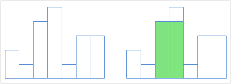

经典题目
这里简要的总结一下它的四种做法
~~最大子矩阵有四种做法，你知道吗~~


- 单调栈
   维护一个单调递增的栈
   栈中保存一个二元组$$\left ( height,sz \right )$$，分别为高度和能覆盖到的宽度
   一个元素只会在超过它能覆盖的最大宽度后退栈
   此时更新答案即可
   
   

- 笛卡尔树
   笛卡尔树的定义这里就不赘述了
   如果有一棵以高度为权值构造好的笛卡尔树
   只需一遍*dfs* 即可得出答案
   用单调栈可在$$O\left ( N\right )$$时间内建树
   维护一个单调递增的栈
   对于新加入的元素*x* ，将最后一个退栈元素作为其左儿子，将其作为栈中*top* 元素的右儿子
   


- 并查集
   一种看似暴力的做法
   实际上复杂度~~应该~~是$$O\left ( N\right )$$
   具体看代码实现
   其中*L* 为当前位置向左能延伸的最大位置，*R* 为向右的


- 倍增
   对于一个区间
   找到其最小值所在位置
   可将其分为左右两个区间递归处理，且互不影响
   倍增数组维护最小值和最小值位置即可
   ~~倍增代码就不放了~~
   
   

代码依次给出
<!--more-->
```c++
#include<cstdio>
#include<stack>
#define LL long long
using namespace std;
struct node {int val,sz;};
int n,x;
LL ans=0;
stack<node> S;
int main()
{
	scanf("%d",&n);
	for(int i=1;i<=n;i++) 
	{
		scanf("%d",&x);
		int sz=0;
		ans=max(ans,(LL)x*sz);
		while (!S.empty()&&x<=S.top().val) 
		{
			sz+=S.top().sz;
			ans=max(ans,(LL)S.top().val*sz);
			S.pop();
		}
		S.push((node){x,sz+1});
	} 
	int sz=0;
	while (!S.empty())
	{
		sz+=S.top().sz;
		ans=max(ans,(LL)S.top().val*sz);
		S.pop();
	}
	printf("%lld",ans);
	return 0;
}
```


```c++
#include<cstdio>
#include<deque>
#define LL long long
using namespace std;
const int N=100050;
int n,rt,L[N],R[N],sz[N],val[N];
LL ans=0;
deque<int> S;
void build()
{
	for(int i=1;i<=n;i++) 
	{
		scanf("%d",&val[i]);
		int x=0;
		while (!S.empty()&&val[i]<val[S.back()]) x=S.back(),S.pop_back();
		if (x) L[i]=x;
		if (!S.empty()) R[S.back()]=i;
		S.push_back(i); 
	}
	rt=S.front();
}
void dfs(int o)
{
	if (!o) return;
	sz[o]=1;
	dfs(L[o]),dfs(R[o]);
	sz[o]+=sz[L[o]]+sz[R[o]];
	ans=max(ans,(LL)val[o]*sz[o]);
}
int main()
{
	scanf("%d",&n);
	build();
	dfs(rt);
	printf("%lld",ans);
	return 0;
}
```

```c++
#include<cstdio>
#include<algorithm>
#define LL long long
using namespace std;
const int N=100050;
int L[N],R[N],val[N],n;
LL ans=0;
int main()
{
    scanf("%d",&n);
    for(int i=1;i<=n;i++) scanf("%d",&val[i]);
    for(int i=1;i<=n;i++) L[i]=i,R[i]=i;
    for(int i=1;i<=n;i++)
        while (L[i]-1>=1&&val[L[i]-1]>=val[i]) L[i]=L[L[i]-1];
    for(int i=n;i>0;i--)
        while (R[i]+1<=n&&val[R[i]+1]>=val[i]) R[i]=R[R[i]+1];
    for(int i=1;i<=n;i++)
        ans=max(ans,(LL)val[i]*(R[i]-L[i]+1));
    printf("%lld",ans);
    return 0;
} 
```

