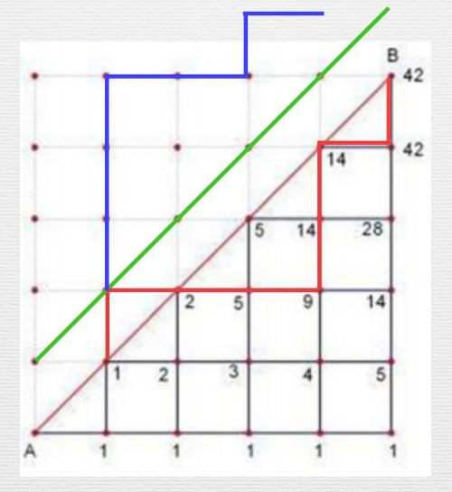

#### 写在前面
感觉组合数学是*OI* （高中数学）中比较难啃的一部分
还是得写点什么来总结一下
组合数$$C,A$$的有关性质这里就不赘述了，高中数学里有
水平不高，只能写一点个人的理解
<!--more-->

   

#### 小球与盒子
*n* 个球放入*m* 个盒子
这个应该是组合数学最经典的题目了

##### 球相同，盒不相同

- 不允许空盒
  $$
  C_{n-1}^{m-1}
  $$
  经典的插板法，*n* 个小球有*n-1* 个空隙，插入*m-1* 块板，分成*m* 个集合

- 允许空盒
  $$
  C_{n+m-1}^{m-1}
  $$
  增加*m* 个球分给每个盒子，分好后从每个盒子中取出一个

##### 球不相同，盒相同

- 不允许空盒
  $$
  S_{n}^{m}
  $$
  *S* 为第二类斯特林数

  **递推公式**
  $$
  S_{n}^{k}=k*S_{n-1}^{k}+S_{n-1}^{k-1}
  $$
  对于第*n* 个球
  它可以放入前面*k* 个盒子中，由于球不相同，可以产生*k* 种方案
  也可以自己放入一个新的盒子中
  ~~易证其正确性~~

  **边界条件**
  $$
  S_{n}^{0}=0,S_{n}^{n}=1
  $$

- 允许空盒
  $$
  \sum _{i=0}^{n}S_{n}^{i}
  $$
  可以有$$1-n$$个空盒

##### 球不相同，盒不相同

- 允许空盒

  $$
  m^{n}
  $$
  放入每个球时均有*m* 种方案

- 不允许空盒
  $$
  S_{n}^{m}*m!
  $$
  盒子不同，需要考虑顺序

##### 球相同，盒相同

- 不允许空盒
  不会生成函数，只能用*DP*
  设$$dp\left [ i \right ]\left [ j \right ]$$为前*i* 个球，放入*j* 个盒子的方案数
  $$
  dp\left [ i \right ]\left [ j \right ]=dp\left [ i -1\right ]\left [ j-1 \right ]+dp\left [ i -j\right ]\left [ j \right ]
  $$
  - 若方案中有若干个盒子只有一个球，挑出其中一个盒子继续求解，方案数为$$dp\left [ i -1\right ]\left [ j-1 \right ]$$
  - 若方案中不存在某个盒子只有一个球，将每个盒子均取出一个球之后继续求解，方案数为$$dp\left [ i -j\right ]\left [ j \right ]$$
  
  答案为$$dp\left [n  \right ]\left [m  \right ]$$

  初始化$$dp\left [0  \right ]\left [0  \right ]=1$$

- 允许空盒
  $$
  dp\left [n+m  \right ]\left [m  \right ]
  $$
  相似的套路，增加*m* 个球分给每个盒子，分好后从每个盒子中取出一个
  
   
  

#### 第一类斯特林数

补充一下第一类斯特林数

**定义**
用*n* 个不同元素构成*m* 个圆排列的方案数 

**递推公式**
$$
S_{n}^{k}=\left ( n-1 \right )*S_{n-1}^{k}+S_{n-1}^{k-1}
$$
对于第*n* 个球
它可以放入前面*k* 个圆排列中，共有*n-1* 个不同的位置，也可以自己放入一个新的盒子中

   

#### 错位排列
**定义**
每个数都不在自己位置上的方案数

由于通项公式计算计算比较烦琐，且不易取模，这里仅讨论递推公式
**递推公式**
$$
D_{i}=\left ( i-1 \right )\left ( D_{i-1}+D_{i-2} \right )
$$
将新加入的元素与每个$$D_{i-1}$$中的每个元素交换，可生成$$\left ( i-1 \right )*D_{i-1}$$个合法排列
这样少考虑了一种情况
例如，元素*1* 在自己位置，元素*2-（i-1）* 均不在自己位置，这时*1* 与*i* 进行交换也可生成合法排列
每个元素均有可能在自己的位置，因此共有$$\left ( i-1 \right )*D_{i-2}$$种方案
~~我是在一节语文课上才想通的~~

   

#### 重复排列

有*k* 个元素，每个元素出现$$c_{i}$$次，$$n=\sum c_{i} $$
~~易得~~方案数
$$
\frac{n!}{\prod_{i=1}^{k} c_{i}!}
$$

   

#### 重复组合

有*k* 个不同的元素，每种元素选择的个数没有限制，选出*n* 个
问题等价于选*n* 次，每次可以选*k* 种球，且不分先后
等价于将*n* 次选择机会分给*k* 种球，机会相同，球不同
等价于将*n* 个相同的球放入*k* 个不同的盒子，且可以为空
方案数为
$$
C_{n+k-1}^{k-1}
$$

   

#### Catlan数

定义有多种，这里讲其中一种
借用一下神犇*wuyiqi* 的图

从左下角到右上角，且不穿过对角线的方案数就是Catlan数

任何一种非法方案均与绿线有交点，例如红线
将其按绿线做对称，例如红线与蓝线

可以发现
- 终点均为$$\left ( n-1,n+1 \right )$$
- 每一种非法方案对应一种$$\left ( 0,0 \right )$$到$$\left ( n-1,n+1 \right )$$的方案

所以总方案数为
$$
C_{2n}^{n}-C_{2n}^{n-1}=\frac{C_{2n}^{n}}{n+1}
$$
再补充两个Catlan数的递推公式
$$
T_{n+1}=\frac{4n+2}{n+2}T_{n}
$$
$$
T_{n+1}=\sum _{i=0}^{n}T_{i}T_{n-i}
$$
另外，在上述模型中比较容易求出一个合法前缀$$\left ( x,y \right )$$的方案数
$$
C_{2n-x-y}^{n-x}-C_{2n-x-y}^{n-1-x}
$$

   

先写这一些，其它的等熟练了再补充(･ω´･ )

